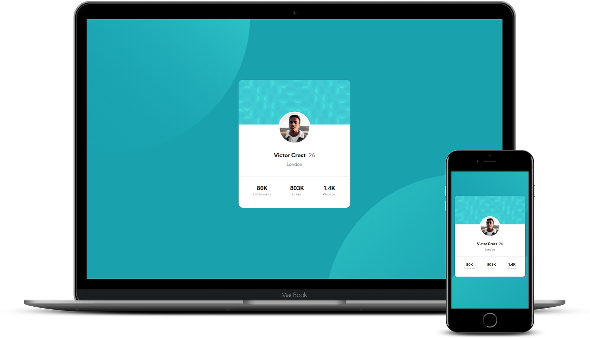

# Frontend Mentor - Profile card component solution

This is a solution to the [Profile card component challenge on Frontend Mentor](https://www.frontendmentor.io/challenges/profile-card-component-cfArpWshJ). Frontend Mentor challenges help you improve your coding skills by building realistic projects. 

## Table of contents

- [Overview](#overview)
  - [The challenge](#the-challenge)
  - [Screenshot](#screenshot)
  - [Links](#links)
- [My process](#my-process)
  - [Built with](#built-with)
  - [What I learned](#what-i-learned)
  - [Useful resources](#useful-resources)
- [Author](#author)

## Overview

### The challenge

- Build out the project to the designs provided

### Screenshot

### Links

- Solution URL: [Add solution URL here](https://your-solution-url.com)

## My process

### Built with

- HTML5
- CSS custom properties
- Flexbox
- SCSS

### What I learned

The main challenge of the project was to get everything to look centered which was done using flexbox.

### Useful resources

- [Flexbox](https://css-tricks.com/snippets/css/a-guide-to-flexbox/) - This guide to flexbox is awesome and serves as a template to position everything you need inside containers.

## Author

- Website - [Beatriz Cabrero](https://xhiel23.github.io/Portfolio/)
- Frontend Mentor - [@Xhiel23](https://www.frontendmentor.io/profile/Xhiel23)

